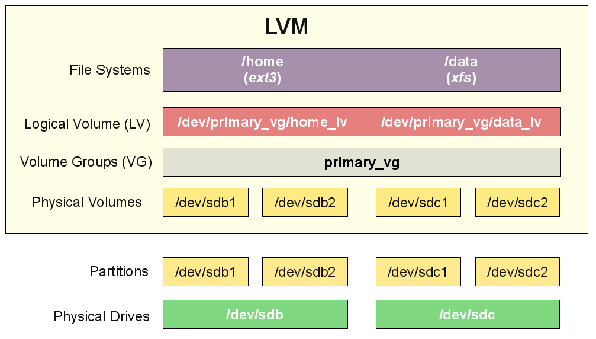

[1]: https://www.tuxcademy.org/download/de/adm1/adm1-de-manual.pdf#chapter.126
[3]: https://www.thomas-krenn.com/de/wiki/Linux_Dateisysteme

# Disk Management


## physikalische Disks

**ACHTUNG: Fehlkonfigurationen mit `fdisk` können mit Datenverlust resultieren**

Die lokalen Physikalischen Platten werden mit dem Utility `fdisk -l` gelistet.
Zum Anzeigen der Partitionen wird `fdsik` mit Angaben zur Physikalischen Disk verwendet.

### Disk Informationen erhalten

Beispiel: Diskinformationen über die Disk /dev/sda ermitteln
```
# fdisk /dev/sda
Welcome to fdisk (util-linux 2.23.2).

Changes will remain in memory only, until you decide to write them.
Be careful before using the write command.

Command (m for help): p

Disk /dev/sda: 8589 MB, 8589934592 bytes, 16777216 sectors
Units = sectors of 1 * 512 = 512 bytes
Sector size (logical/physical): 512 bytes / 512 bytes
I/O size (minimum/optimal): 512 bytes / 512 bytes
Disk label type: dos
Disk identifier: 0x000b0465

   Device Boot      Start         End      Blocks   Id  System
/dev/sda1   *        2048     2099199     1048576   83  Linux
/dev/sda2         2099200    16777215     7339008   8e  Linux LVM

Command (m for help):
```


**/dev/sda1** steht für:

+ dev - Device
+ sda - Disk Bezeichnung (Beginnt in der Regel mit a, die zweite Platte hat dann b (sdb) usw..)
+ 1 - die erste Partition


### Partition erstellen
`fdisk /dev/sdb`

mit *p* wir die aktuelle Partitionierung gelistet

```
Command (m for help): p

Disk /dev/sdb: 8589 MB, 8589934592 bytes, 16777216 sectors
Units = sectors of 1 * 512 = 512 bytes
Sector size (logical/physical): 512 bytes / 512 bytes
I/O size (minimum/optimal): 512 bytes / 512 bytes
Disk label type: dos
Disk identifier: 0x51425b27

   Device Boot      Start         End      Blocks   Id  System
```
## Filesystem

Linux kennt wie auch Windows unterschiedliche Filesysteme. Die meisten Distributionen verwenden eines der folgenden FS als Standard.

 + EXT4
 + xfs

Die Wahl des Filesystem Typs hängt vom Verwendungszweck ab und wird teils auch von der verwendeten Software vorgegeben.
Eine Übersicht der gängigen FS und ihren Eigenschaften finden sie [hier][3] .

### ein Filesystem erstellen

Abhängig vom Filesystem werden unterschiedliche Kommandos verwendet. Unabhängig vom FS muss dieses entweder in einer *Disk Partition* oder einem *logical Volume* erstellt werden.

##### Beispiel EXT4 Filesystem erstellen

Folgendes Beispiel erzeugt ein *EXT4 Filesystem* in der Disk Partition `/dev/sdb1`

`# mkfs.ext4 /dev/sdb1`


## LVM - logical Volume Management

LVM oder auch logical Volume Management ist ein Abstraktionlayer über der physikalischen Platte(n). Der grosse Vorteil besteht darin, dass der Speicherplatz durch Zufügen von weiteren Platten dynamisch und flexibel vergrössert oder auch verkleinert werden kann.  Die Partitionierung ist nicht mehr auf die Grösser der physikalischen Platte beschränkt.

### Aufbau

Damit eine Platte oder Partition für *LVM* verwendet werden kann, muss diese zuerst als **physical Volume** in *LVM* definiert werden. Danach werden eine oder mehrere *physical Volumes* zu einer **Volume Group** zusammengefasst. Danach werden in der *volumes Groups* die *logical Volumes* erstellt. Die *logical Volumes* sind mit den Partitionen einer Platte vergleichbar. In den *logical Volumes* werden denn auch die Filesysteme erstellt.




### Informationen erhalten

Mit nachfolgenden Befehlen listen Informationen zu den verschiedenen LVM Layer:

+ `pvs` - physical Volumes
+ `vgs` - volume Groups
+ `lvs` - logical Volume

Zusätzliche Attribute können mit diesen Kommandos angezeigt werden:

+ `pvdisplay` - physical Volumes
+ `vgdisplay` - volume Groups
+ `lvdisplay` - logical Volume

### Vorgehen LVM Erstellen

Um ein Filesystem basieren auf LVM zu erstellen, sind folgende Schritte nötig.

+ Physical Volume erstellen
+ Volume Group erstellen
+ Logical Volume erstellen
+ Filesystem erstellen
+ Filesystem mounten

Für den Abbau sind dieselben Schritte mit Ausnahme des Filesystem in umgekehrter Reihenfolge anzuwenden.

### Physical Volume - PV

Ein *physical Volume* kann entweder aus einer komplette Disk oder einer bestimmte Partition einer Disk erstellt werden. Dazu muss noch kein Filesystem auf der Disk oder der Partition vorhanden sein. Mit `pvcreate` wird die Disk oder Partition ins *LVM* aufgenommen (geflaggt).

##### ein PV auf einer Partition erstellen

```
# pvcreate /dev/sdb1
  Physical volume "/dev/sdb1" successfully created.
```

### Volume Group - VG

Eine *Vulume Group* setze sich aus einem oder mehreren *physical Volumes* zusammen.

##### VG erstellen

Eine VG `vg_tbz` mit dem PV `/dev/sdb1` erstellen. Das PV muss vorgängig mit `pvcreate` erstellt wirden sein, vorhandene PV können mit `pvs` angezeigt werden


```
# vgcreate vg_tbz /dev/sdb1
  Volume group "vg_tbz" successfully created
```

##### VG erweitern

Der VG `vg_tbz` das PV `/dev/sdb2` zufügen.

```
# vgextend vg_tbz /dev/sdb2
  Volume group "vg_tbz" successfully extended
```


### Logical Volume - LV

##### LV erstellen

Ein *logical Volume* wird auf dem freiem Speicherplatz eine *Volumes Group* erstellt.

Beispiel:

```
# lvcreate -L 2G -n data1 vg_tbz
  Logical volume "data1" created.
```

Nachdem mit `mkfs.ext4 -m 0 /dev/vg_tbz/data1` ein Filesystem auf dem LV erstellt wurde, kann dieses gemountet werden.

`# mount /dev/mapper/vg_tbz-data1 /<mount-point>`

##### LV vergrössern

Ein *logical Volume* kann vergrössert (oder auch verkleinert) werden, solange die *Volume Group* über entsprechende Kapazität verfügt.

Beispiel: *logical Volume* `data1` um 1Gb vergrössern:

```
# lvextend -L +1G /dev/vg_tbz/data1
  Size of logical volume vg_tbz/data1 changed from 2.00 GiB (512 extents) to 3.00 GiB (768 extents).
  Logical volume vg_tbz/data1 successfully resized.
```

Nachdem ein LV vergrössert wurde, muss das sich darauf befindende Filesystem ebenfalls vergrössert werden. Abhängig vom Filesystem sind dazu unterschiedliche Befehle nötig.

Beispiel: ein EXT4 Filesystem vergrössern:

```
# resize2fs /dev/mapper/vg_tbz-data1
resize2fs 1.42.9 (28-Dec-2013)
Filesystem at /dev/mapper/vg_tbz-data1 is mounted on /tbz; on-line resizing required
old_desc_blocks = 1, new_desc_blocks = 1
The filesystem on /dev/mapper/vg_tbz-data1 is now 786432 blocks long.
```
**ACHTUNG:** Die Vergrösserung kann auch bei gemountetem Filesystem erfolgen. Trotzdem ist es *best practies*, dass FS vorher zu unmounten.

##### LV verkleinern
Bevor ein LV verkleinert werden kann, **MUSS** das darunterliegende Filesystem auf eine Grösse die kleiner als das künftige LV ist verkleinert werden. **Nichtbeachten dieser Regel führt zu Datenverlust**

Anders als beim Vergrössern des Filesystem, darf beim Verkleinern (shrink) das Filesystem nicht gemountet sein. Zudem muss vor der Grössenänderung ein **Filesystemcheck** durchgeführt werden.

Beispiel: das Filesystem `/dev/mapper/vg_tbz-data1` mit `resize2fs -M` auf minimalste Grösse shrinken:

```
# umount /tbz

# e2fsck -f /dev/mapper/vg_tbz-data1
e2fsck 1.42.9 (28-Dec-2013)
Pass 1: Checking inodes, blocks, and sizes
Pass 2: Checking directory structure
Pass 3: Checking directory connectivity
Pass 4: Checking reference counts
Pass 5: Checking group summary information
/dev/mapper/vg_tbz-data1: 11/196608 files (0.0% non-contiguous), 30268/786432 blocks

# resize2fs -M /dev/mapper/vg_tbz-data1
resize2fs 1.42.9 (28-Dec-2013)
Resizing the filesystem on /dev/mapper/vg_tbz-data1 to 26364 (4k) blocks.
The filesystem on /dev/mapper/vg_tbz-data1 is now 26364 blocks long.
```

Mit `lvresize` können *LV* vergrössert oder verkleinert werden.

Beispiel: Bestehendes LV mit `lvresize` auf die Grösse von 1Gb setzen:

```
[root@w901s ~]# lvresize --size 1G /dev/mapper/vg_tbz-data1
  WARNING: Reducing active logical volume to 1.00 GiB.
  THIS MAY DESTROY YOUR DATA (filesystem etc.)
Do you really want to reduce vg_tbz/data1? [y/n]: y
  Size of logical volume vg_tbz/data1 changed from 3.00 GiB (768 extents) to 1.00 GiB (256 extents).
  Logical volume vg_tbz/data1 successfully resized.
```

Danach muss das darunterliegende Filesystem der neuen LV Grösse angepasst werden:

```
# resize2fs -p /dev/mapper/vg_tbz-data1
resize2fs 1.42.9 (28-Dec-2013)
Resizing the filesystem on /dev/mapper/vg_tbz-data1 to 262144 (4k) blocks.
The filesystem on /dev/mapper/vg_tbz-data1 is now 262144 blocks long.
```

Die neue Grösse (1G) ist nach dem mounten des Filesystem ersichtlich:
```
# mount /dev/mapper/vg_tbz-data1 /tbz/

# df -h /tbz/
Filesystem                Size  Used Avail Use% Mounted on
/dev/mapper/vg_tbz-data1  944M  5.1M  923M   1% /tbz
```

## wichtige Befehle

|Befehl | Bedeutung|
|:--:|--|
|fdisk|Disk Partitions Utillity|
|mkfs|Filesystem erzeugen|
|e2fsck|Filesystemcheck|
|resize2fs|Filesystem Grösse anpassen|
|pvs|lvm - Informationen über physical Volumes|
|pvdisplay| lvm - Attribute von physical Volumes listen|
|pvcreate| lvm - physical Volume erzeugen |
|vgs| lvm - Informationen über Volumes Groups|
|vgdisplay| lvm - Attribute von Volumes Groups listen|
|lvs|lvm - Informationen über logical Volumes|
|lvdisplay| lvm - Attribute von logical Volumes listen|
|lvcreate| lvm - logical Volume erzeugen |
|lvresize| lvm - logical Volume Grösse anpassen|


## weitere Infos
mehr zu diesem Thema finden sie [hier][1]
